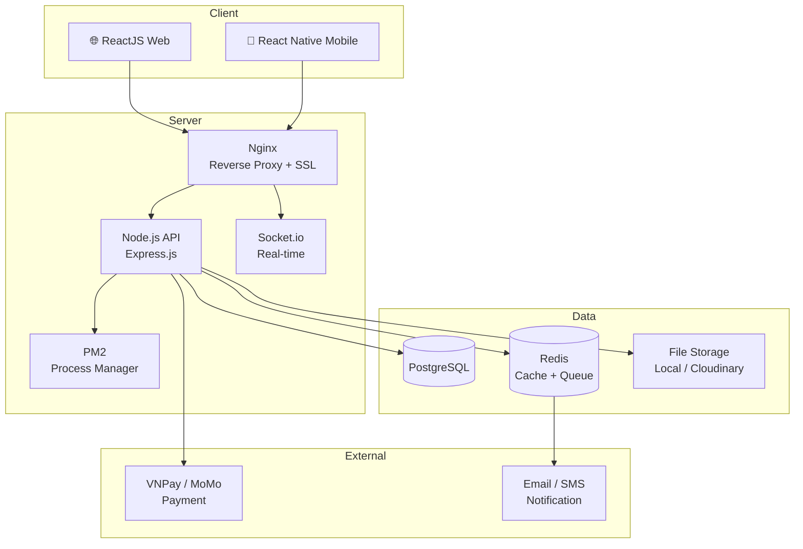
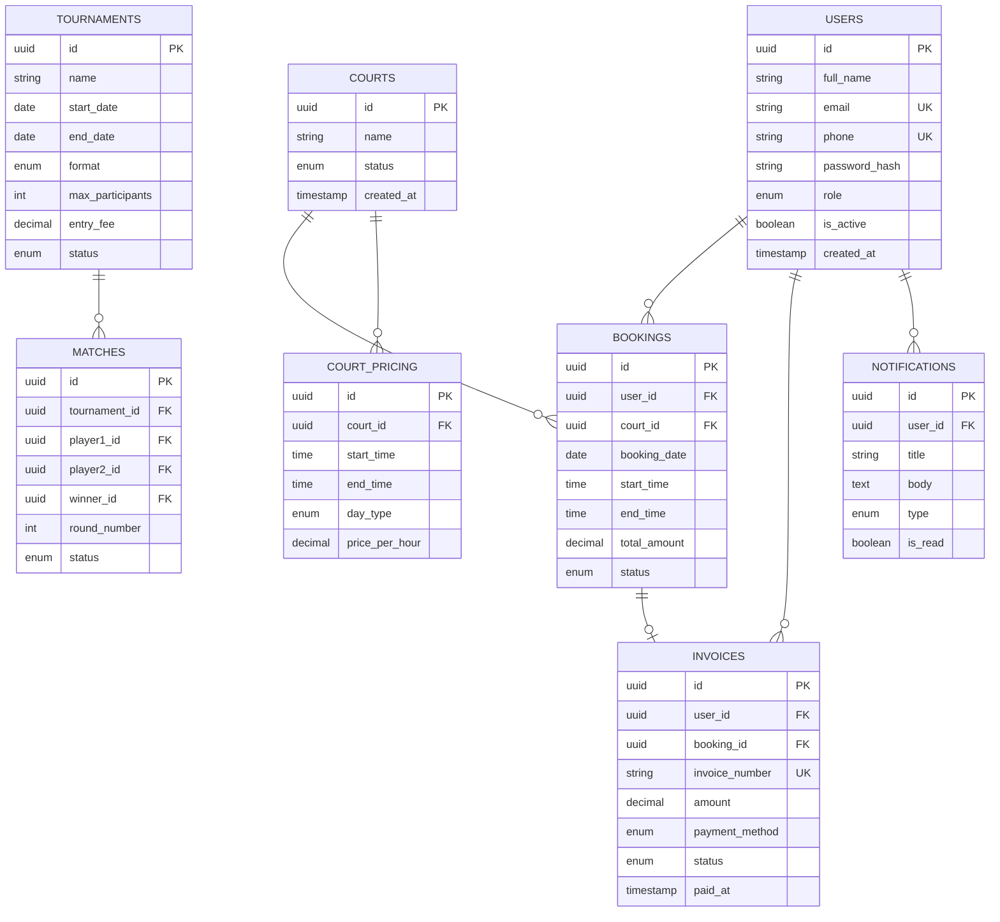

---
tags:
  - project
  - backend
  - frontend
  - mobile
status: Planning
created: 2026-05-09
stack: ReactJS · Node.js · PostgreSQL · Nginx
---

# 🏸 Hệ Thống Quản Lý Cầu Lông 84

> [!NOTE] Mô tả
> Hệ thống quản lý toàn diện cho câu lạc bộ cầu lông, bao gồm quản lý thành viên, đặt sân, giải đấu, thanh toán và báo cáo thống kê.

---

## 📌 Thông Tin Chung

| Thuộc tính | Chi tiết |
| --- | --- |
| **Tên dự án** | Hệ Thống Quản Lý Cầu Lông 84 |
| **Loại** | Web App + Mobile App |
| **Thời gian** | 22 tuần |
| **Frontend** | ReactJS 18 + Vite |
| **Mobile** | React Native (Expo) |
| **Backend** | Node.js + Express.js |
| **Database** | PostgreSQL 16 |
| **Cache** | Redis |
| **Deploy** | Nginx + PM2 |

---

## 🧱 Kiến Trúc Hệ Thống



---

## ⚙️ Stack Công Nghệ

### Frontend & Mobile

| Công nghệ | Vai trò |
| --- | --- |
| ReactJS 18 + Vite | Web SPA |
| React Native (Expo) | iOS & Android |
| TanStack Query | Server state, caching |
| Zustand | Global state management |
| Ant Design | UI component library |
| Socket.io Client | Real-time updates |

### Backend

| Công nghệ | Vai trò |
| --- | --- |
| Node.js + Express.js | REST API server |
| Socket.io | WebSocket real-time |
| Prisma ORM | Type-safe PostgreSQL queries |
| JWT + Refresh Token | Xác thực & phân quyền |
| BullMQ | Job queue (email, SMS, notif) |
| PM2 (cluster mode) | Process manager |

### Infrastructure

| Công nghệ | Vai trò |
| --- | --- |
| PostgreSQL 16 | Cơ sở dữ liệu chính (native) |
| Redis | Cache, session, BullMQ |
| Nginx | Serve static + reverse proxy |
| Let's Encrypt (Certbot) | SSL miễn phí |
| GitHub Actions | CI/CD tự động |

---

## 📂 Cấu Trúc Thư Mục

```
HỆ THỐNG QUẢN LÝ CẦU LÔNG 84/
│
├── backend/
│   ├── src/
│   │   ├── config/             # Cấu hình DB, Redis, env
│   │   ├── modules/
│   │   │   ├── auth/           # Đăng ký, đăng nhập, JWT
│   │   │   ├── members/        # Quản lý thành viên
│   │   │   ├── courts/         # Quản lý sân
│   │   │   ├── bookings/       # Đặt lịch sân
│   │   │   ├── tournaments/    # Giải đấu
│   │   │   ├── payments/       # Thanh toán, hóa đơn
│   │   │   ├── notifications/  # Thông báo
│   │   │   └── reports/        # Thống kê, báo cáo
│   │   ├── middleware/         # Auth guard, error, rate limit
│   │   ├── socket/             # Socket.io handlers
│   │   ├── jobs/               # BullMQ background jobs
│   │   └── utils/              # Helpers, validators
│   ├── prisma/
│   │   ├── schema.prisma
│   │   └── migrations/
│   ├── ecosystem.config.js     # PM2 config
│   └── package.json
│
├── frontend/
│   ├── src/
│   │   ├── assets/
│   │   ├── components/         # Shared components
│   │   ├── pages/
│   │   │   ├── auth/
│   │   │   ├── dashboard/
│   │   │   ├── courts/
│   │   │   ├── bookings/
│   │   │   ├── tournaments/
│   │   │   ├── payments/
│   │   │   └── reports/
│   │   ├── hooks/
│   │   ├── stores/             # Zustand
│   │   ├── services/           # Axios API calls
│   │   └── utils/
│   └── package.json
│
├── mobile/
│   ├── src/
│   │   ├── screens/
│   │   ├── navigation/
│   │   ├── components/
│   │   ├── hooks/
│   │   └── services/
│   └── package.json
│
├── nginx/
│   └── caulong84.conf
│
└── .env.example
```

---

## 🗄️ Database Schema

### Các bảng chính



---

## 🔑 Phân Quyền (RBAC)

| Tính năng | 👑 Admin | 🧑‍💼 Staff | 👤 Member |
| --- | :---: | :---: | :---: |
| Quản lý thành viên | ✅ | 👁️ xem | ❌ |
| Thêm / sửa / xóa sân | ✅ | ✅ | ❌ |
| Đặt sân | ✅ | ✅ | ✅ |
| Tạo giải đấu | ✅ | ❌ | ❌ |
| Đăng ký giải đấu | ✅ | ✅ | ✅ |
| Cập nhật kết quả | ✅ | ✅ | ❌ |
| Xem báo cáo doanh thu | ✅ | ❌ | ❌ |
| Xuất hóa đơn | ✅ | ✅ | 👁️ của mình |
| Quản lý giá sân | ✅ | ❌ | ❌ |

---

## 🌐 API Endpoints

```
AUTH
  POST   /api/v1/auth/register
  POST   /api/v1/auth/login
  POST   /api/v1/auth/logout
  POST   /api/v1/auth/refresh-token
  POST   /api/v1/auth/forgot-password

MEMBERS
  GET    /api/v1/members
  GET    /api/v1/members/:id
  PUT    /api/v1/members/:id
  GET    /api/v1/members/:id/history

COURTS
  GET    /api/v1/courts
  POST   /api/v1/courts
  PUT    /api/v1/courts/:id
  DELETE /api/v1/courts/:id
  GET    /api/v1/courts/:id/schedule
  GET    /api/v1/courts/:id/status      ← real-time

BOOKINGS
  GET    /api/v1/bookings/my
  POST   /api/v1/bookings
  PUT    /api/v1/bookings/:id/cancel

TOURNAMENTS
  GET    /api/v1/tournaments
  POST   /api/v1/tournaments
  PUT    /api/v1/tournaments/:id
  GET    /api/v1/tournaments/:id/bracket
  POST   /api/v1/tournaments/:id/register
  PUT    /api/v1/matches/:id/result

PAYMENTS
  POST   /api/v1/payments/initiate
  POST   /api/v1/payments/callback      ← webhook
  GET    /api/v1/invoices/:id
  GET    /api/v1/invoices/:id/pdf

REPORTS  (Admin only)
  GET    /api/v1/reports/revenue
  GET    /api/v1/reports/court-usage
  GET    /api/v1/reports/leaderboard
```

---

## 🗓️ Lộ Trình Phát Triển

> [!NOTE] Tổng quan lộ trình
> Dự án gồm **10 giai đoạn** trong **22 tuần**, bao phủ đầy đủ từ nền tảng, nghiệp vụ cốt lõi, mobile app, kiểm thử đến vận hành và bảo trì sau deploy.

---

### Giai đoạn 1 — Nền Tảng & Xác Thực (Tuần 1–2)

> **Mục tiêu:** Dựng khung dự án, kết nối DB, hoàn thiện hệ thống xác thực.

- [x] Khởi tạo repo + cấu trúc thư mục (monorepo)
- [x] Cài đặt môi trường: PostgreSQL, Redis, Node.js trên máy dev
- [x] Thiết kế và migrate database schema (Prisma Migrate)
- [x] Cấu hình biến môi trường `.env`, logging (Winston)
- [x] Module Auth: đăng ký, đăng nhập, logout, JWT + Refresh Token
- [x] RBAC middleware (Admin / Staff / Member)
- [ ] Rate limiting, CORS, Helmet security headers
- [x] Trang Login / Register — Web (ReactJS)

---

### Giai đoạn 2 — Quản Lý Thành Viên (Tuần 3–4)

> **Mục tiêu:** Xây dựng module quản lý thành viên đầy đủ cho cả Admin, Staff và Member tự quản lý hồ sơ.

- [x] API CRUD thành viên (Admin toàn quyền, Staff chỉ xem)
- [ ] Upload & quản lý ảnh đại diện (Cloudinary / local)
- [x] Trang hồ sơ cá nhân: xem & cập nhật thông tin
- [x] Tìm kiếm, lọc, phân trang danh sách thành viên
- [x] Lịch sử đặt sân & lịch sử thanh toán của từng thành viên
- [x] Phân quyền chi tiết: kích hoạt / khóa tài khoản (Admin)
- [x] Giao diện web: trang Quản Lý Thành Viên (Admin/Staff)

---

### Giai đoạn 3 — Quản Lý Sân & Đặt Lịch (Tuần 5–7)

> **Mục tiêu:** Quản lý sân, giá theo khung giờ và hệ thống đặt lịch real-time.

- [x] CRUD quản lý sân (Admin/Staff)
- [x] Hệ thống giá theo khung giờ / ngày trong tuần (COURT_PRICING)
- [x] Đặt lịch sân, kiểm tra xung đột thời gian
- [x] Hủy đặt sân và hoàn tiền tự động
- [ ] Real-time trạng thái sân (Socket.io rooms theo `court_id`)
- [ ] Calendar view lịch đặt sân (tuần / ngày)
- [x] Giao diện web: trang Quản Lý Sân & Đặt Lịch

---

### Giai đoạn 4 — Quản Lý Giải Đấu (Tuần 8–10)

> **Mục tiêu:** Module giải đấu hoàn chỉnh từ tạo đến kết quả cuối cùng.

- [x] Tạo và quản lý giải đấu (Admin)
- [x] Đăng ký / hủy đăng ký thi đấu
- [x] Tự động sinh bảng đấu knock-out / round-robin
- [x] Cập nhật kết quả trận đấu theo thời gian thực
- [x] Bảng xếp hạng vận động viên (leaderboard)
- [ ] Thông báo lịch thi đấu qua email / push notification
- [x] Giao diện web: trang Giải Đấu & Bracket

---

### Giai đoạn 5 — Thanh Toán & Hóa Đơn (Tuần 11–12)

> **Mục tiêu:** Tích hợp cổng thanh toán, hóa đơn PDF và theo dõi công nợ.

- [ ] Tích hợp VNPay / MoMo (sandbox → production)
- [ ] Xác thực webhook bằng HMAC-SHA256
- [ ] Xuất hóa đơn PDF (PDFKit / Puppeteer)
- [x] Theo dõi công nợ, trạng thái thanh toán
- [ ] BullMQ: gửi email xác nhận thanh toán bất đồng bộ
- [x] Giao diện web: trang Thanh Toán & Hóa Đơn

---

### Giai đoạn 6 — Thông Báo & Tự Động Hóa (Tuần 13)

> **Mục tiêu:** Hệ thống thông báo đa kênh và các tác vụ nền tự động.

- [ ] BullMQ job queue: email, SMS, push notification
- [x] Thông báo đặt sân thành công, xác nhận hủy, nhắc lịch thi đấu
- [ ] Scheduled jobs: nhắc lịch trước 1 giờ, tổng hợp báo cáo cuối ngày
- [x] In-app notification (Socket.io + bảng NOTIFICATIONS)
- [x] Trang thông báo: xem, đánh dấu đã đọc, xóa

---

### Giai đoạn 7 — Báo Cáo & Dashboard (Tuần 14)

> **Mục tiêu:** Bộ báo cáo thống kê đầy đủ cho Admin.

- [x] Dashboard tổng quan: doanh thu, lượng đặt sân, thành viên mới
- [x] Báo cáo doanh thu theo ngày / tuần / tháng (biểu đồ)
- [x] Báo cáo tỷ lệ sử dụng sân theo khung giờ
- [ ] Xuất báo cáo ra Excel / CSV
- [x] Bảng xếp hạng vận động viên tích lũy
- [x] Lọc báo cáo theo khoảng thời gian tùy chỉnh

---

### Giai đoạn 8 — Mobile App (Tuần 15–17)

> **Mục tiêu:** Phát triển ứng dụng React Native (Expo) cho iOS & Android với các tính năng cốt lõi.

- [ ] Khởi tạo dự án Expo, cấu hình navigation (React Navigation)
- [ ] Màn hình: Đăng nhập / Đăng ký
- [ ] Màn hình: Hồ sơ cá nhân & chỉnh sửa thông tin
- [ ] Màn hình: Danh sách sân & đặt lịch sân
- [ ] Màn hình: Lịch sử đặt sân & hóa đơn
- [ ] Màn hình: Giải đấu & bảng xếp hạng
- [ ] Push notification (Expo Notifications)
- [ ] Tích hợp thanh toán VNPay WebView / MoMo Deep Link
- [ ] Build APK / IPA (EAS Build)

---

### Giai đoạn 9 — Kiểm Thử & QA (Tuần 18–19)

> **Mục tiêu:** Đảm bảo chất lượng hệ thống trước khi go-live.

- [ ] Unit test backend: auth, booking logic, payment validation (Jest)
- [ ] Integration test API: tất cả endpoint với Supertest
- [ ] E2E test web: luồng đặt sân, thanh toán, đăng ký giải đấu (Playwright)
- [ ] Kiểm thử Mobile: luồng chính trên thiết bị thật / emulator
- [ ] Performance test: load test 100–500 concurrent users (k6 / Artillery)
- [ ] Security audit: SQL injection, XSS, CSRF, JWT attack
- [ ] Kiểm tra responsive UI trên các trình duyệt & kích thước màn hình
- [ ] Sửa bug, tối ưu query chậm (EXPLAIN ANALYZE)

---

### Giai đoạn 10 — Deploy & Vận Hành (Tuần 20–21)

> **Mục tiêu:** Triển khai lên VPS production, cấu hình CI/CD và giám sát hệ thống.

- [ ] Cài PostgreSQL, Redis, Node.js, Nginx trên VPS
- [ ] Cấu hình PM2 (`ecosystem.config.js`), auto-start khi reboot
- [ ] `npm run build` → Nginx serve `dist/`
- [ ] SSL miễn phí với Let's Encrypt (Certbot), cấu hình HTTPS
- [ ] GitHub Actions → SSH auto deploy (CI/CD pipeline)
- [ ] Cấu hình backup PostgreSQL tự động (cron + pg_dump)
- [ ] Monitoring: uptime, CPU/RAM, error rate (Grafana / Uptime Kuma)
- [ ] Logging tập trung (Winston → file, gửi alert khi lỗi nghiêm trọng)
- [ ] Load test 100–500 concurrent users trên production
- [ ] Publish Mobile App lên Google Play (Android) / TestFlight (iOS)

---

### Giai đoạn 11 — Bảo Trì & Tối Ưu (Tuần 22+)

> **Mục tiêu:** Vận hành ổn định, thu thập phản hồi, cải tiến liên tục sau go-live.

- [ ] Thu thập phản hồi từ người dùng thực tế (Admin, Staff, Member)
- [ ] Phân tích log lỗi, theo dõi các API chậm
- [ ] Tối ưu index PostgreSQL theo query thực tế
- [ ] Mở rộng Redis cache cho các endpoint nhiều lượt truy cập
- [ ] Cập nhật dependencies (security patches)
- [ ] Bổ sung tính năng mới theo yêu cầu (backlog)
- [ ] Review & refactor code định kỳ
- [ ] Nâng cấp hạ tầng VPS nếu cần thiết (scale up / horizontal scale)

---

## 🚀 Cấu Hình Deploy

### Nginx (`caulong84.conf`)

```nginx
server {
    listen 80;
    server_name caulong84.com;
    return 301 https://$host$request_uri;
}

server {
    listen 443 ssl http2;
    server_name caulong84.com;

    ssl_certificate     /etc/letsencrypt/live/caulong84.com/fullchain.pem;
    ssl_certificate_key /etc/letsencrypt/live/caulong84.com/privkey.pem;

    # Serve React build
    root /var/www/caulong84/frontend/dist;
    index index.html;

    location / {
        try_files $uri $uri/ /index.html;
    }

    # Proxy API → Node.js (PM2)
    location /api/ {
        proxy_pass         http://127.0.0.1:4000;
        proxy_set_header   Host $host;
        proxy_set_header   X-Real-IP $remote_addr;
    }

    # WebSocket
    location /socket.io/ {
        proxy_pass         http://127.0.0.1:4000;
        proxy_http_version 1.1;
        proxy_set_header   Upgrade $http_upgrade;
        proxy_set_header   Connection "upgrade";
    }
}
```

### PM2 (`ecosystem.config.js`)

```js
module.exports = {
  apps: [{
    name    : 'caulong84-api',
    script  : './src/server.js',
    instances : 2,
    exec_mode : 'cluster',
    watch   : false,
    env: {
      NODE_ENV : 'production',
      PORT     : 4000,
    }
  }]
};
```

---

## ⚠️ Lưu Ý Quan Trọng

> [!WARNING] Bảo mật thanh toán
> Luôn xác thực webhook từ VNPay/MoMo bằng **HMAC-SHA256**. Không tin tưởng bất kỳ callback nào từ phía client.

> [!CAUTION] Mật khẩu
> Hash bằng `bcrypt` với cost factor ≥ 12. **Tuyệt đối không** lưu plain text. JWT secret phải ≥ 256-bit, lưu trong `.env`.

> [!TIP] Hiệu năng DB
> Đánh **index** PostgreSQL cho: `booking_date`, `user_id`, `court_id`, `status`. Dùng Redis cache lịch sân theo ngày để giảm tải DB.

> [!NOTE] Real-time
> Dùng **Socket.io rooms** theo từng sân (`room: court_id`) thay vì broadcast toàn hệ thống để tránh tốn băng thông.

---

## 🔗 Tài Nguyên Tham Khảo

- [Prisma Docs](https://www.prisma.io/docs)
- [Socket.io Docs](https://socket.io/docs/v4)
- [BullMQ Docs](https://docs.bullmq.io)
- [PM2 Docs](https://pm2.keymetrics.io/docs)
- [VNPay Sandbox](https://sandbox.vnpayment.vn/apis)
- [Let's Encrypt / Certbot](https://certbot.eff.org)

---

*Cập nhật lần cuối: 2026-05-16*
